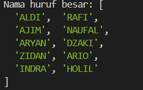
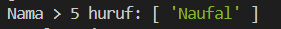
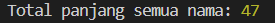
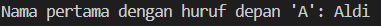

# Tugas Array Methods JavaScript

## Identitas

- **Nama**: Abdul Wafa'
- **NIM**: F1D022104

## Deskripsi Tugas

Tugas ini adalah mengimplementasikan enam metode array JavaScript (map, filter, reduce, find, some, every) menggunakan data nama teman sekelas. Tujuan tugas ini adalah memahami cara kerja dan perbedaan setiap metode dalam memanipulasi data array.

## Implementasi

### map()

- **Tujuan**: Mengubah semua nama teman sekelas menjadi huruf besar agar seragam dan mudah dibaca.
- **Screenshot**:
  

### filter()

- **Tujuan**: Mengambil nama teman yang panjangnya lebih dari 5 huruf untuk mengetahui siapa saja yang memiliki nama panjang.
- **Screenshot**:
  

### reduce()

- **Tujuan**: Menghitung total panjang semua nama teman sekelas untuk mengetahui jumlah karakter seluruh nama.
- **Screenshot**:
  

### find()

- **Tujuan**: Mencari nama pertama yang huruf depannya sama dengan huruf depan nama saya, untuk mengetahui siapa saja yang memiliki kemiripan awal nama.
- **Screenshot**:
  

### some()

- **Tujuan**: Mengecek apakah ada nama teman yang panjangnya lebih dari 10 huruf, untuk mengetahui keberadaan nama yang sangat panjang.
- **Screenshot**:
  

### every()

- **Tujuan**: Mengecek apakah semua nama teman memiliki panjang lebih dari 3 huruf, untuk memastikan tidak ada nama yang terlalu pendek.
- **Screenshot**:
  

## Kesimpulan

Setiap metode array memiliki fungsi dan kegunaan yang berbeda:

- **map()** untuk memodifikasi setiap elemen array.
- **filter()** untuk mengambil elemen yang memenuhi kondisi tertentu.
- **reduce()** untuk mengakumulasi nilai dari seluruh elemen array.
- **find()** untuk mencari satu elemen pertama yang cocok dengan kondisi.
- **some()** untuk mengecek apakah minimal satu elemen memenuhi kondisi.
- **every()** untuk memastikan semua elemen memenuhi kondisi.
  Dengan memahami dan mengimplementasikan metode-metode ini, manipulasi data array menjadi lebih efisien dan sesuai kebutuhan.
